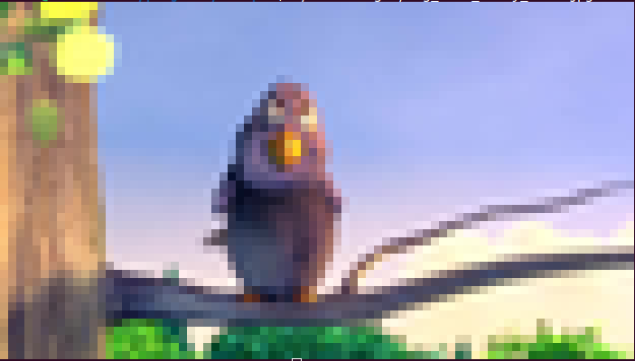

# My ANSI Art
Current ANSI Art image implementations use just one char "▀" (half block) to display low resolution image in a terminal.

This PoC aims to verify that using full range of ANSI block chars we can achive better resolution using the same number of chars.

## siv4 vs my-poc

#### original image 

| siv4  | my-poc  |
| --- | --- |
|  $ ./siv4 doc/imgs/big_buck_bunny_bird.jpg  | $ ./my-poc doc/imgs/big_buck_bunny_bird.jpg |
|  |  |

More exemples [here](examples.md)

### References (aka "Standing on the shoulders of giants")
* Shell Image Viewer v4 - https://www.uninformativ.de/git/bin-pub/file/siv4.html
* (Almost) square pixels in the terminal - http://www.uninformativ.de/blog/postings/2016-12-17/0/POSTING-en.html
* ANSI Block Elements - https://en.wikipedia.org/wiki/Block_Elements
* https://en.wikipedia.org/wiki/ANSI_escape_code#24-bit
